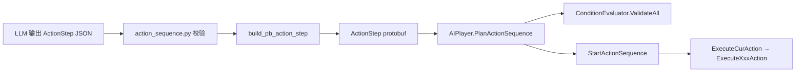

# ActionSequence 新增 Action 类型

在 `action.py` 增加一种新动作（如 `jump`）时，需同步改 Python 模型、protobuf `ActionStep`、序列化、Unity 执行器。**通常不需要**新增 `plan_action_sequence_cmd` 等工具本身。

## 两类 Action

| 基类 | 适用场景 | Python condition | Unity 执行模式 |
|------|----------|------------------|----------------|
| `StateChangeAction` | 持续进行，靠 condition 结束（wait、move） | **必填**，Pydantic 校验 | 每帧 `ConditionEvaluator.Evaluate` + FSM 状态 |
| `BaseAction` | 一次完成（interact、select、input） | 无（proto 层 `ActionStep.condition` 可为空） | 执行一次 → 直接 `OnActionFinished` |

## 改动清单（以新增 `JumpAction` 为例）

### A. 协议（ActionStep 结构，非 NetMessageRequest）

1. `Tools/message.proto`
   - 在 `ActionStep.oneof action` 增加字段，如 `JumpAction jump = 7;`
   - 新增 message：
     ```protobuf
     message JumpAction {
       float height = 1;
     }
     ```
2. 执行 `1.genproto.cmd` → Rebuild → `2.copyprotocol.cmd`
   - **注意**：改的是 `ActionStep` 子类型，不是 `AgentXxxRequest`；`MessageDispatch.cs` 通常不用改。

### B. Python 模型层

| 文件 | 改动 |
|------|------|
| `action_sequence_model/model/action.py` | 新增 `JumpAction` 类，`action: Literal["jump"]` |
| `action_sequence_model/model/action_sequence.py` | `Union[...]` 加入 `JumpAction` |
| `base_tools.py` | `build_pb_action_step()` 增加 `isinstance` 分支；`from action import` 补别名 |
| `base_tools.py` | `plan_action_sequence_cmd` docstring 补充新 action 的 JSON 示例（推荐） |

`build_pb_action_step` 模板：

```python
elif isinstance(step, JumpActionModel):
    pb_step.jump.height = step.height
```

### C. Unity 执行层

| 文件 | 改动 |
|------|------|
| `ActionSequenceRuntime.cs` | `CreateActionRuntimeLog()` 识别 `action.Jump`，设置 `ActionName` |
| `AIPlayer.cs` | `ExecuteCurAction()` 增加 `curAction.Jump != null` 分支 |
| `AIPlayer.cs` | 新增 `ExecuteJumpAction(ActionSequenceRuntime)` |

#### Execute 模板选择

**持续型**（参考 `ExecuteMoveAction` / `ExecuteWaitAction`）：

- `State == Todo` 时初始化 `StartPostion`、`StartEnv`、`CompleteConditionFunc`
- `CompleteConditionFunc` 内更新 `conditionCxt.ActionTime/Displacement`，调用 `mConditionEvaluator.Evaluate`
- 设置 `ErrorConditionFunc`（碰撞等）
- `ChangeState("Move")` 或对应 FSM 状态

**瞬发型**（参考 `ExecuteInteractAction`）：

- 执行一次场景逻辑
- 写 `mCurActionRuntime.Result.Message`
- 设 `Done/Failed` → `mCurActionRuntime = null` → `OnActionFinished`

### D. 条件判断器（按需）

| 场景 | 是否改 ConditionEvaluator | 改哪里 |
|------|---------------------------|--------|
| 新 action 复用现有变量（displacement、objects[i].State 等） | **否** | — |
| 新增 condition 根变量（如 `stamina`） | **是** | Python `core/types.py` `CONDITION_VARIABLES`；Unity `ConditionContext` 属性 + `SetVariables()` |
| 新增 `objects[i]` 可访问属性（如 `Health`） | **是** | Unity `SceneObjExprView` + `ExprViewFactory.From`；Python `members` 集合 |
| 新 condition 写法需语义校验 | **是** | `ConditionEvaluator` 新增 `ValidateXxxReference` 并在 `ValidateAll` 调用 |
| 新 action 需要自定义函数（如 `Distance`） | **是** | `ConditionEvaluator` 构造函数 `SetFunction(...)` |

Python 侧 condition 变量与 Unity **必须同名**，否则 LLM 写的表达式两端行为不一致。

当前 Unity 已注入变量（`ConditionEvaluator.SetVariables`）：

```
myself, objects, displacement, actionTime, canInteract, nearestInteractableIndex
```

当前 `objects[i]` 可访问成员（`ExprViewFactory` / Python members）：

```
Position, Velocity, State
```

### E. 工具注册

新增 Action **类型** 一般**不需要**改 `agent_interuptible.py`——`plan_action_sequence_cmd` 等工具已存在，只是 `ActionStep` 载荷扩展。

仅当新增**全新动作序列工具**（而非 Action 类型）时，才走通用 tool 开发流程。

## 数据流



## 现有 Action 对照表

| action 字段 | Python 类 | 基类 | Proto oneof | Unity 执行函数 |
|-------------|-----------|------|-------------|----------------|
| wait | WaitAction | StateChangeAction | wait | ExecuteWaitAction |
| move | MoveAction | StateChangeAction | move | ExecuteMoveAction |
| interact | InteractAction | BaseAction | interact | ExecuteInteractAction |
| select | SelectAction | BaseAction | select | ExecuteSelectAction |
| input | InputAction | BaseAction | input | ExecuteInputAction |

## 完成检查

```
- [ ] proto ActionStep.oneof 新字段号无冲突
- [ ] 1.genproto.cmd 成功
- [ ] action.py + action_sequence.py 已注册 Union
- [ ] build_pb_action_step 新分支
- [ ] ActionSequenceRuntime.CreateActionRuntimeLog 新分支
- [ ] AIPlayer.ExecuteCurAction + ExecuteXxxAction
- [ ] 若新 condition 变量/成员：types.py + ConditionContext + SetVariables
- [ ] 若新语义规则：ConditionEvaluator.ValidateAll
- [ ] plan_action_sequence_cmd docstring 示例已更新
- [ ] 规划阶段 ValidateAll 通过；执行阶段 condition 能正确结束动作
```
