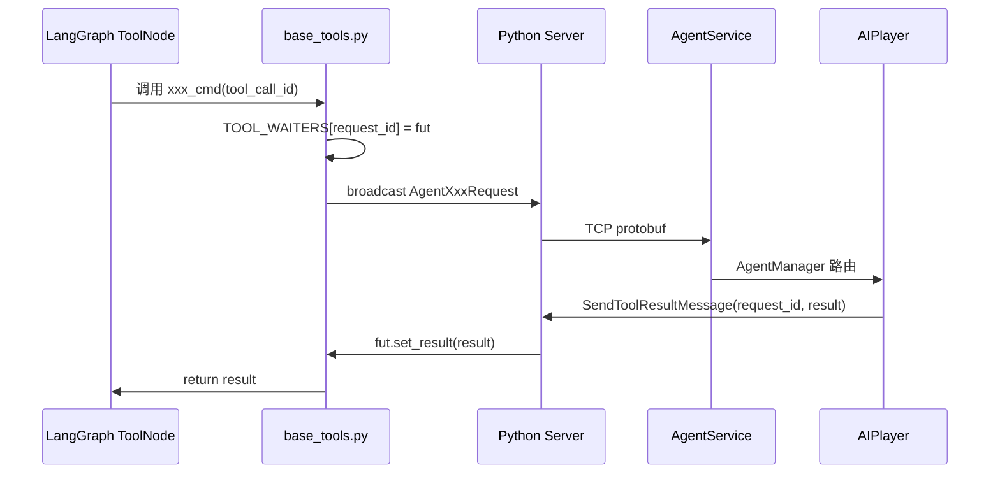

# Agent Tool 开发参考

## 架构数据流



长时任务额外路径：Player 在之后某时刻调用 `SendUserFeedback` → Agent 收到新消息，无需走 `TOOL_WAITERS`。

## 协议文件位置

| 文件 | 作用 |
|------|------|
| `Tools/message.proto` | 唯一协议源 |
| `Tools/1.genproto.cmd` | 生成 C# + Python |
| `Tools/2.copyprotocol.cmd` | 部署 DLL 到 Unity |
| `Src/Lib/AgentProtocol/message.cs` | 生成产物，勿手改 |
| `Src/PythonServer/network/message_pb2.py` | 生成产物，勿手改 |
| `Src/Lib/Common/Network/MessageDispatch.cs` | 手写：Request 分发 |

## proto 片段模板

```protobuf
// NetMessageRequest 内
AgentXxxRequest agentXxxRequest = 30;

// 文件末尾
message AgentXxxRequest {
    string agent = 1;
    string request_id = 2;
    // ...业务字段
}
```

## 定时器工具完整示例（本次实践）

### 协议

| 工具 | Message | NetMessageRequest 字段 |
|------|---------|------------------------|
| `set_timer_cmd` | `AgentSetTimerRequest` | `agentSetTimerRequest` |
| `get_timer_list_cmd` | `AgentGetTimerListRequest` | `agentGetTimerListRequest` |
| `remove_timer_cmd` | `AgentRemoveTimerRequest` | `agentRemoveTimerRequest` |

### 改动文件一览

| 文件 | 改动 |
|------|------|
| `Tools/message.proto` | 3 个 Request + NetMessageRequest 字段 |
| `MessageDispatch.cs` | 3 行 RaiseEvent |
| `base_tools.py` | 3 个 `@tool` 函数 |
| `AgentService.cs` | 3 个 event + Subscribe + Handler |
| `AgentManager.cs` | 3 组事件转发 |
| `AIPlayer.cs` | SetTimer / GetTimerList / RemoveTimer + UpdateTimers |
| `TimerRuntime.cs` | 定时器运行时数据 |
| `agent_interuptible.py` | tools 列表注册 |

### 行为约定

- `set_timer_cmd` / `get_timer_list_cmd` / `remove_timer_cmd`：同步 RPC，立即 `SendToolResultMessage`
- 定时器到期：`SendFeedbackToAgent("[定时器到期] ...")`，不阻塞原 tool await
- `timer_repeat=true`：到期后重置倒计时，不删除 runtime

## 常见错误

| 问题 | 原因 | 处理 |
|------|------|------|
| `AttributeError: AgentXxxRequest` | 未跑 genproto 或手改 pb2 | 改 proto 后执行 `1.genproto.cmd` |
| 工具一直超时 | Unity 未 SendToolResultMessage | 检查 AIPlayer 是否回调；requestId 是否等于 tool_call_id |
| Unity 收不到请求 | MessageDispatch 未分发 | 补 `MessageDispatch.cs` 并 Rebuild + copyprotocol |
| C# 事件订阅失败 | Protocol DLL 未更新 | Rebuild + `2.copyprotocol.cmd` |
| UnityAction 编译错误 | 泛型参数超过 4 个 | 改用 `Action<...>` |

## 本地工具（无需 Unity）

示例：`add_alarm`, `search_fact_memories`, `get_cur_time`

- 写在 `base_tools.py`，直接调用 `AlarmSystem` / `MemoryManager` 等
- 不需要 proto、不需要 `_cmd` 后缀
- 同样在 `agent_interuptible.py` 注册
