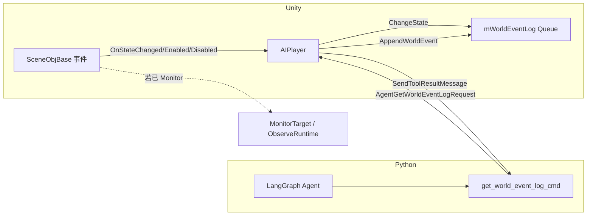

# 技术方案 — v0.20.10 WorldEventLog 世界事件日志

> **状态**：已实现  
> **依据 PRD**：`PRD.md`  
> **最后更新**：2026-06-10

---

## 1. 方案概述

在 Unity `AIPlayer` 侧新增有界滚动队列 `mWorldEventLog`，通过复用现有 `SceneObjManager.OnSceneObjCreated` 与 `SceneObjBase` 三类事件，自动收集全局状态变化；在 `AIPlayer.ChangeState` 中补充自身状态记录。Python 侧新增同步 RPC 工具 `get_world_event_log_cmd`，经协议 `AgentGetWorldEventLogRequest` 向 Unity 拉取格式化文本。MonitorTarget 代码路径不改动。

---

## 2. 影响范围

| 层级 | 模块/路径 | 变更类型 |
|------|-----------|----------|
| 协议 | `Tools/message.proto` | 新增 `AgentGetWorldEventLogRequest` + `NetMessageRequest` 字段 30 |
| 协议生成 | `Tools/1.genproto.cmd` → `MessageDispatch.cs` → Rebuild → `2.copyprotocol.cmd` | 执行生成 |
| Python | `agent_framwork/tools/base_tools.py` | 新增 `get_world_event_log_cmd` |
| Python | `agent_framwork/agents/agent_interuptible.py` | `tools` 列表注册 |
| Unity | `AIPlayer.cs` | 核心：队列、注册、记录、查询、ChangeState 钩子 |
| Unity | 新建 `WorldEventRecord.cs` | 数据结构（可放 `Action/WorldEventLog/` 目录，对齐 `ObserveRuntime`） |
| Unity | `RuntimeInfoRenderer.cs` | 新增 `FormatSceneObjLabel`、`BuildIndexChangeNotice` 等 |
| Unity | `SceneObjBase.cs` | **调整 `OnDisable` 顺序**：先 `OnObjectDisabled`，再 `UnRegister` |
| Unity | `AgentService.cs` | 订阅/事件 `OnGetWorldEventLog` |
| Unity | `AgentManager.cs` | 路由到 `AIPlayer.GetWorldEventLog` |
| Unity | `MessageDispatch.cs`（Lib/Common） | 分发新 Request |

**不变**：`ObserveRuntime`、`MonitorTarget`、`GetMonitorRecords`、记忆系统、GameFlow。

---

## 3. 详细设计

### 3.1 数据与协议

**Proto**（`Tools/message.proto`）：

```protobuf
message AgentGetWorldEventLogRequest {
    string agent = 1;
    string request_id = 2;
}
```

在 `NetMessageRequest` 追加：

```protobuf
AgentGetWorldEventLogRequest agentGetWorldEventLogRequest = 30;
```

字段仅 `agent` + `request_id`，无额外参数；与 `AgentGetMonitorRecordsRequest` 对比更简单。

### 3.2 Unity（Environment）

#### 3.2.1 WorldEventRecord

```csharp
public class WorldEventRecord
{
    public float Time;
    public string ObjectName;
    public string OldState;
    public string NewState;
    public string EventText;
}
```

#### 3.2.2 AIPlayer 成员

```csharp
private const int MaxWorldEvents = 100;
private readonly Queue<WorldEventRecord> mWorldEventLog = new();
// 用于 OnDisable 时批量取消订阅
private readonly Dictionary<SceneObjBase, Action<SceneObjBase, string, string>> mWorldEventHandlers = new();
```

#### 3.2.3 对象编号与索引变化（`RuntimeInfoRenderer`）

新增辅助方法，与现有 `RenderObserveRuntimeSummary` 中 `对象: {index}. {name}` 风格一致：

```csharp
// 返回 "2. 按钮" 或 "按钮(目前不在环境列表内)"
public string FormatSceneObjLabel(SceneObjBase obj, List<SceneObjBase> sceneObjs);

// newState == "Appearance" | "Disappearance" 时追加 [索引变化] 段
public string BuildIndexChangeNotice(
    SceneObjBase obj,
    string newState,
    List<SceneObjBase> sceneObjsBeforeChange);
```

**出现**：`sceneObjsBeforeChange` 为事件后列表（`OnObjectEnabled` 在 `Register` 之后触发），`IndexOf(obj)` 得新编号；因 `Register` 为尾部 `Add`，输出「新出现物体: N. xxx」「其余物体索引未变」。

**消失**：依赖 3.2.3b 中 `OnDisable` 顺序调整，在 `UnRegister` 前用 `sceneObjsBeforeChange` 计算 `removedIndex`，对 `i > removedIndex` 的物体生成 `原 i. Name -> 现 i-1. Name` 列表。

#### 3.2.3b `SceneObjBase.OnDisable` 顺序调整（必要）

当前实现先 `UnRegister` 再 `OnObjectDisabled`，导致消失事件触发时物体已不在 `mSceneObjs`，无法解析编号与前移关系。

```csharp
protected virtual void OnDisable()
{
    OnObjectDisabled?.Invoke(this, StateName, "Disappearance");  // 先通知
    if (SceneObjManager.Instance != null)
        SceneObjManager.Instance.UnRegister(this);
}
```

`OnEnable` 保持先 `Register` 后 `OnObjectEnabled` 不变。`MonitorTarget` 等现有监听仅依赖状态字符串，不受顺序调整影响。

#### 3.2.3c 写入逻辑 `AppendWorldEvent`

```csharp
private void AppendWorldEventForSceneObj(SceneObjBase obj, string oldState, string newState)
{
    var sceneObjs = SceneObjManager.Instance.GetSceneObjsExcluding(gameObject);
    var renderer = new RuntimeInfoRenderer();
    string label = renderer.FormatSceneObjLabel(obj, sceneObjs);
    string msg = $"[世界事件]对象:{label} 状态:{oldState} -> {newState}";

    if (newState == "Appearance" || newState == "Disappearance")
        msg += "\n\n" + renderer.BuildIndexChangeNotice(obj, newState, sceneObjs);

    AppendWorldEvent(label, oldState, newState, msg);
}

private void AppendWorldEventForSelf(string oldState, string newState)
{
    string msg = $"[世界事件]对象:{Name} 状态:{oldState} -> {newState}";
    AppendWorldEvent(Name, oldState, newState, msg);
}

private void AppendWorldEvent(string objectName, string oldState, string newState, string msg)
{
    var record = new WorldEventRecord
    {
        Time = Time.time,
        ObjectName = objectName,
        OldState = oldState,
        NewState = newState,
        EventText = CreateMessageText(msg, includeObserveTagerts: false)
    };
    mWorldEventLog.Enqueue(record);
    while (mWorldEventLog.Count > MaxWorldEvents)
        mWorldEventLog.Dequeue();
}
```

`ObjectName` 字段：SceneObj 存 `"{index}. {Name}"` 或兜底文本；Agent 自身存 `Name`（无编号）。

#### 3.2.4 SceneObj 自动注册

扩展现有 `OnSceneObjCreated`（当前仅用于 ActionSequence）：

```csharp
private void OnSceneObjCreated(SceneObjBase obj)
{
    mCurActionSequenceRuntime?.AddSceneObj(obj);
    mPlanningActionSequenceRuntime?.AddSceneObj(obj);
    RegisterWorldEventListener(obj);  // 新增
}

private void RegisterWorldEventListener(SceneObjBase obj)
{
    if (obj == null || mWorldEventHandlers.ContainsKey(obj))
        return;

    Action<SceneObjBase, string, string> handler = (o, oldState, newState) =>
    {
        AppendWorldEventForSceneObj(o, oldState, newState);
        if (newState == "Disappearance")
            UnregisterWorldEventListener(o);
    };

    mWorldEventHandlers[obj] = handler;
    obj.OnStateChanged += handler;
    obj.OnObjectEnabled += handler;
    obj.OnObjectDisabled += handler;
}

private void UnregisterWorldEventListener(SceneObjBase obj)
{
    if (obj == null || !mWorldEventHandlers.TryGetValue(obj, out var handler))
        return;
    obj.OnStateChanged -= handler;
    obj.OnObjectEnabled -= handler;
    obj.OnObjectDisabled -= handler;
    mWorldEventHandlers.Remove(obj);
}
```

`OnEnable` 中已有对 `GetSceneObjsExcluding` 的遍历，会经 `OnSceneObjCreated` 触发注册，无需重复逻辑。

`OnDisable` 补充：

```csharp
foreach (var kv in mWorldEventHandlers.ToList())
    UnregisterWorldEventListener(kv.Key);
mWorldEventHandlers.Clear();
mWorldEventLog.Clear();  // 与 mTimerRuntimes.Clear() 一致，SceneStop 后不残留
```

#### 3.2.5 AIPlayer 自身状态

在 `AIPlayer` 中 override `ChangeState`：

```csharp
public override void ChangeState(string stateName)
{
    string oldState = GetStateName();
    base.ChangeState(stateName);
    if (oldState != stateName && oldState != null)
        AppendWorldEventForSelf(oldState, stateName);
}
```

注意：`base.ChangeState` 在 `oldState == stateName` 时早退，override 侧也需判断，避免重复记录。

#### 3.2.6 GetWorldEventLog 输出

按 **旧→新** 正序遍历队列（`Queue` 本身 FIFO，直接迭代即可，事件1 = 最早）：

```csharp
public void GetWorldEventLog(string requestId)
{
    float now = Time.time;
    var sb = new StringBuilder();
    sb.AppendLine("[世界事件记录]");
    sb.AppendLine($"总记录数: {mWorldEventLog.Count}");

    int idx = 1;
    foreach (var r in mWorldEventLog)
    {
        float elapsed = now - r.Time;
        sb.AppendLine();
        sb.AppendLine($"==========事件{idx}==========");
        sb.AppendLine($"时间: {elapsed:F1}秒前");
        sb.AppendLine(r.EventText);  // 已含事件摘要 + 你的状态 + 场景 + 环境
        idx++;
    }

    AgentService.Instance.SendToolResultMessage(Name, "GetWorldEventLog", requestId, sb.ToString());
}
```

格式化可抽到 `RuntimeInfoRenderer.RenderWorldEventLog`，与 `RenderObserveTargetRuntime` 风格一致。

#### 3.2.7 AgentService / AgentManager

参照 `OnGetMonitorRecords` 模式：

- `AgentService`：`Subscribe<AgentGetWorldEventLogRequest>` → 触发 `OnGetWorldEventLog(agent, requestId)`
- `AgentManager`：OnEnable 订阅 → `agentObj.GetWorldEventLog(requestId)`

### 3.3 Python（Brain）

`base_tools.py` 新增：

```python
@tool
async def get_world_event_log_cmd(
    agent: Annotated[str, InjectedState("name")],
    tool_call_id: Annotated[str, InjectedToolCallId],
) -> str:
    """获取世界事件日志。

    使用场景:
    - 需要按统一时间线查看多个场景对象（含自身）的状态变化时。
    - 用于发现跨对象事件关联、尚未 Monitor 的对象的重要变化。

    与 GetMonitorRecords 的区别:
    - GetMonitorRecords 面向已 Monitor 的单个目标，记录更深。
    - GetWorldEventLog 面向全局，容量有限但覆盖所有已注册 SceneObj。

    Return:
        str: 按时间正序（旧→新）排列的世界事件记录文本，每条含发生时刻的环境快照。
    """
    # 同步 RPC 模板，同 get_monitor_records_cmd
```

`agent_interuptible.py` 的 `tools` 列表追加 `base_tools.get_world_event_log_cmd`（建议放在 `get_monitor_records_cmd` 之后）。

### 3.4 架构关系图



---

## 4. 实现步骤

1. **协议**：修改 `message.proto` → 运行 `1.genproto.cmd` → 更新 `MessageDispatch.cs` → Rebuild `CSharpClient.sln` → `2.copyprotocol.cmd`。
2. **Unity 基础修正**：`SceneObjBase.OnDisable` 调整事件顺序。
3. **Unity 数据层**：新增 `WorldEventRecord.cs`；`RuntimeInfoRenderer` 增加编号/索引变化辅助方法。
4. **Unity 核心**：在 `AIPlayer.cs` 实现队列、注册/注销、Append、ChangeState override、`GetWorldEventLog`。
5. **Unity 路由**：`AgentService.cs`、`AgentManager.cs` 接线。
6. **Python**：`get_world_event_log_cmd` + `agent_interuptible.tools` 注册。
7. **联调验证**：机关联动 + 物体 Enable/Disable → 核对编号、`[索引变化]` 与 MonitorTarget 独立性。

---

## 5. 风险与回退

| 风险 | 缓解 |
|------|------|
| SceneObj 销毁后委托悬空 | `Disappearance` 时主动 `UnregisterWorldEventListener`；`OnDisable` 全量清理 |
| 消失事件时无法 IndexOf | 调整 `SceneObjBase.OnDisable`：`OnObjectDisabled` 先于 `UnRegister` |
| 编号漂移导致认知冲突 | 出现/消失事件追加 `[索引变化]` 自然语言说明，不引入 UUID |
| 与 MonitorTarget 重复记录导致 token 浪费 | 属设计预期；工具 docstring 说明二者分工，不在本期做去重 |
| 每条含完整环境快照，100 条全量返回 token 很大 | 与 MonitorTarget 一致；docstring 提醒按需调用；后续可加条数/时间过滤参数 |
| 高频状态机抖动填满 100 条 | 与需求一致接受；后续可考虑合并同类事件（本期不做） |
| `OnObjectEnabled` 初始化洪水 | 场景加载时可能批量 Appearance；容量 100 足够一般关卡，必要时后续加快照过滤 |
| 协议 field number 冲突 | 使用 30（当前最大 29），生成后 diff 确认 |

**回退**：移除新 proto 字段与工具注册，删除 `AIPlayer` 中 WorldEventLog 相关代码即可，不影响 MonitorTarget。

---

## 6. 测试建议

1. **单对象**：移动平台 Idle ↔ Moving，确认 WorldEventLog 有条目，Monitor 未开启时也能查到。
2. **跨对象因果**：按钮 → 电梯 → 平台联动，调用 `GetWorldEventLog`，确认三条记录时间正序且每条含当时 `<环境>` 快照。
3. **Agent 自身**：执行 `move_cmd` 后查日志，应含 Agent Name 的状态 Idle → Move → Idle。
4. **容量**：脚本或快速机关触发 >100 次变化，确认队列长度恒为 100 且最旧被挤出。
5. **创建顺序**：仅 SceneObj 先存在 / 仅 AIPlayer 先存在，两种情况下新 Spawn 的 SceneObj 均被记录。
6. **编号与索引变化**：重名物体事件可区分；物体 Disable 后日志含「原 N -> 现 N-1」；Agent 自身事件无编号。
7. **回归**：MonitorTarget 三路观察 + GetMonitorRecords 输出与改动前一致；`OnDisable` 顺序调整后 Monitor 消失记录仍正常。

---

## 7. 实现记录（开发完成后填写）

| 日期 | 说明 |
|------|------|
| 2026-06-10 | 完成协议、Unity WorldEventLog、Python `get_world_event_log_cmd` 全链路；`SceneObjBase.OnDisable` 顺序已调整 |

---

*本文档由 Cursor Agent 根据 PRD 生成；**你确认后** Agent 方可按本方案修改代码。*
