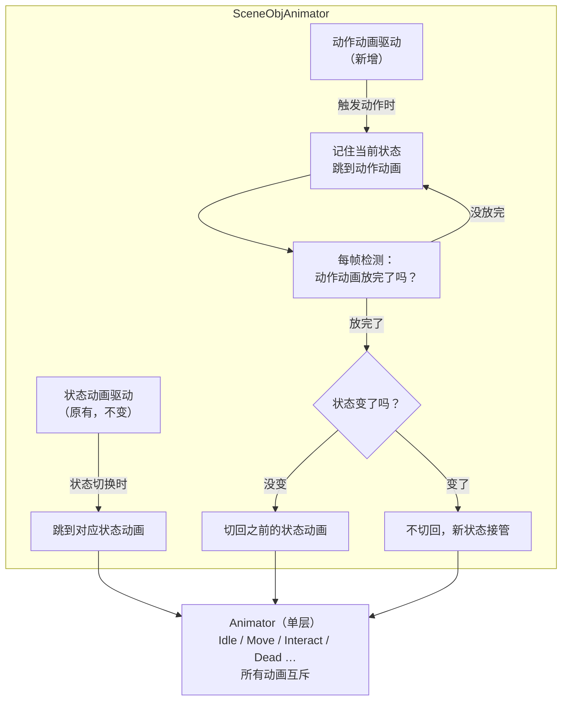
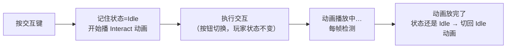
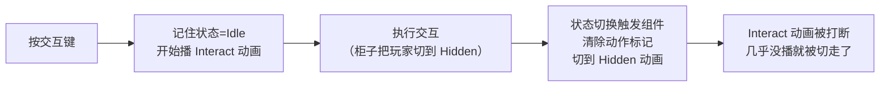
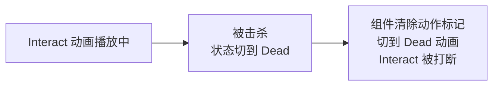
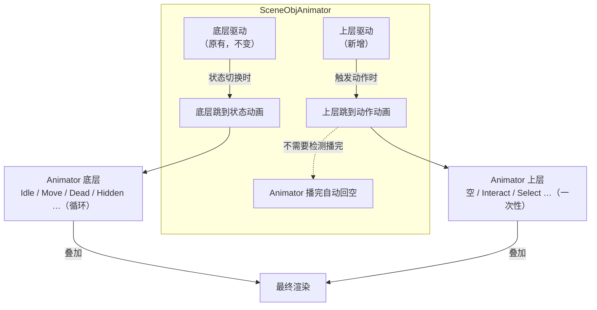
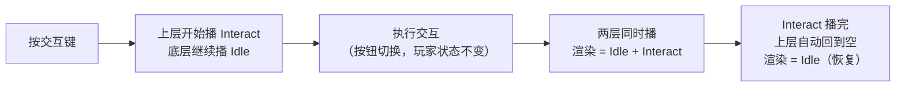
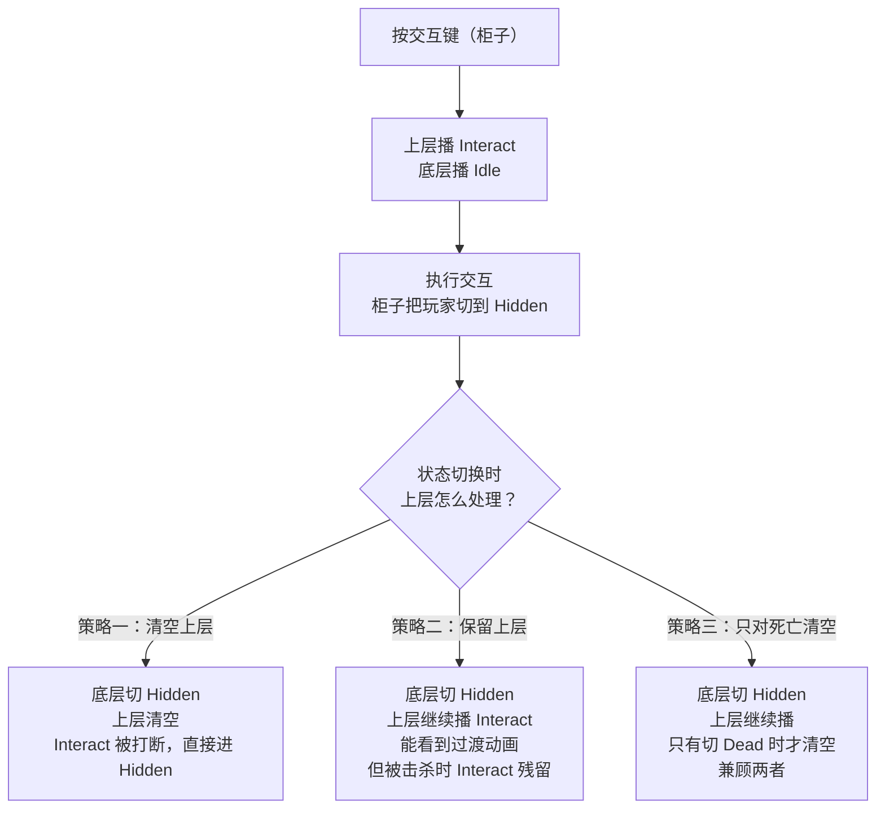
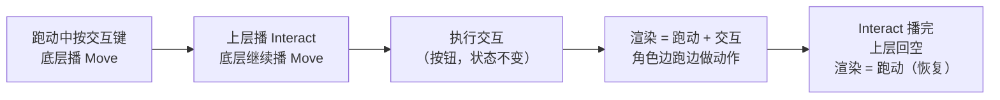
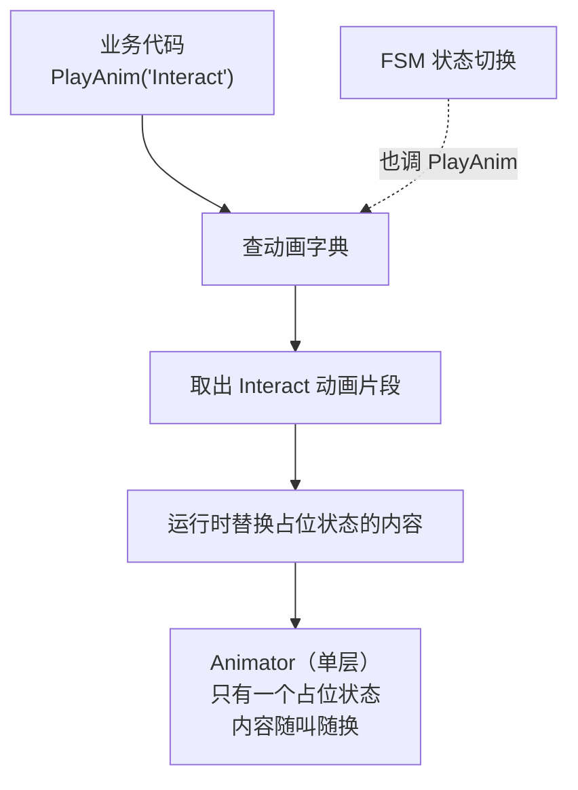

# 技术方案 - v0.22.18 动画系统架构重构

> **状态**：已确认
> **依据 PRD**：`PRD.md`
> **最后更新**：2026-08-10

---

## 1. 要解决什么问题

现有动画组件只认 FSM 状态：状态一变，动画跟着变。但 Interact/Select/TextInput 这类瞬时动作**没有 FSM 状态**，执行时角色停在 Idle，动作一帧完成。组件感知不到，动画不播。

更麻烦的是，Interact 的后果**由被交互对象决定，调用方无法预判**：

- 按按钮：玩家状态不变（纯播个动画）
- 背刺敌人：玩家状态不变（播个攻击动画）
- 进柜子：玩家状态变成 Hidden（动画得过渡过去）
- 爬梯子（未做）：玩家状态变成 Climb（同理）

而且同一个被交互物体，不同交互方式动画也不同：
- 商人正面交互：交易动画
- 商人背面交互：盗窃动画

所以动画系统得同时处理"状态不变播完回原样"和"状态变了过渡到新状态"两种情况，且动画选择不能写死在被交互物体上。

### 两类交互，两种处理方式

| 类型 | 例子 | 玩家 FSM 状态变了吗 | 怎么播动画 |
|------|------|-------------------|-----------|
| **状态切换型** | 柜子、梯子、门 | 变了（Hidden/Climb） | 不用 PlayOneShot，FSM 状态切换自然驱动底层动画 |
| **纯动作型** | 按按钮、背刺、盗窃 | 没变（还是 Idle） | 需要 PlayOneShot，因为 FSM 不动 |

状态切换型交互完全不需要额外动画机制--现有的 FSM + 底层动画就能处理。PlayOneShot 只管纯动作型交互。

---

## 2. 三个方案一句话概括

| 方案 | 一句话 | 改 Animator 吗 |
|------|--------|---------------|
| **A. 单层加塞** | 还是同一个动画层，插播一次性动画，播完靠代码切回来 | 加几个动画状态 |
| **B. 双层分离**（推荐） | 拆成两层：底层管状态动画，上层管动作动画，互不干扰 | 加一个新层 |
| **C. 全盘重写** | 抛弃状态映射，所有动画运行时动态替换 | 只留一个占位状态 |

下面逐个展开。

---

## 3. 方案 A：单层加塞

### 3.1 怎么工作

所有动画还在同一个 Animator 层上。组件新加一个方法 `PlayOneShot("Interact")`，作用是：记住当前状态，跳到 Interact 动画播。播完后，组件每帧检测"动画放完了没"，放完了就切回之前的状态动画。

**核心问题**：同一个层上，状态动画和动作动画是**互斥**的--播 Interact 就不能同时播 Idle，跑动中按交互键，跑动会被打断。

### 3.2 架构图



### 3.3 场景流程

#### 按按钮（状态不变）



#### 进柜子（状态变化）



#### 交互中被击杀



### 3.4 优缺点

**优点**：改动最小，只加一个方法几个字段，Animator 加几个孤立状态就行。

**缺点**：
- 跑动中按交互，跑动被打断（同层互斥）
- 播完检测靠代码每帧查"放完没"，如果动画被别的地方打断，检测可能失灵
- 进柜子等状态切换场景，动作动画刚开播就被切走，玩家看不到过渡

---

## 4. 方案 B：双层分离（推荐）

### 4.1 怎么工作

Animator 拆成两层：

- **底层（Base）**：管 FSM 状态动画（Idle/Move/Dead/Hidden…），和现在完全一样，不动
- **上层（Action）**：管一次性动作动画（Interact/Select/TextInput…），独立播放

上层默认是空的（透出底层）。触发动作时，上层播放动作动画，播完后 Animator 自动回到空（不需要代码检测）。两层**互不干扰**：底层播 Idle，上层播 Interact，渲染结果是两个叠加。

**关键优势**：跑动中按交互，底层继续跑，上层播交互--角色边跑边做动作。而且播完检测靠 Animator 自带的"播完自动跳回"机制，不需要代码猜测。

### 4.2 架构图



### 4.3 场景流程

#### 按按钮（状态不变）



#### 进柜子（状态变化）

这里有个时序选择：状态切换时，上层要不要清空？两种策略：



#### 跑动中交互（方案 B 独有）



### 4.4 优缺点

**优点**：
- 跑动中交互不打断跑动（方案 A 做不到）
- 播完检测靠 Animator 机制，不靠代码猜测，稳健
- 未来加受击/拾取/技能，都是上层加个状态 + 调一下，不动底层
- 底层 = 现有配置原样不动，已配的 Prefab 零改动

**缺点**：
- Animator 要多配一个层（一次性成本）
- 上层清空策略需要决定（策略一/二/三）

---

## 5. 方案 C：全盘重写

### 5.1 怎么工作

彻底抛弃"FSM 状态名 = 动画状态名"的映射。Animator 里只留一个占位状态，组件维护一个"动画名 → 动画片段"的字典。业务代码调 `PlayAnim("Interact")` 时，组件从字典取出对应的 AnimationClip，运行时替换占位状态的内容，触发播放。

### 5.2 架构图



### 5.3 优缺点

**优点**：最灵活，动画和 Animator 结构完全解耦。

**缺点**：
- 丢失 Animator 的 Transition、BlendTree、参数能力（全被绕过）
- v0.22.17 的物理参数透传、转换边动画都要重写
- 改动面最大，等于推倒重做
- 和现有配置完全不兼容

---

## 6. 三方案对比

| 维度 | A. 单层加塞 | B. 双层分离 | C. 全盘重写 |
|------|-----------|-----------|-----------|
| 改动量 | 小 | 中 | 大 |
| 跑动中交互 | 跑动被打断 | **边跑边交互** | 跑动被打断 |
| 播完检测 | 代码每帧查（脆弱） | **Animator 自动（稳健）** | 需自己实现 |
| 动画叠加 | 不能 | **能** | 不能 |
| 扩展性 | 差（补丁越打越多） | **好**（上层随时加） | 好但丢能力 |
| 现有配置兼容 | 完全兼容 | 完全兼容 | 不兼容 |
| Animator 配置 | 加几个状态 | 加一个层 | 只留占位状态 |

**核心差异**：方案 A 是在单层上硬塞，方案 B 是分层各管各的，方案 C 是推倒重来。B 的能力是 A 的超集（B 配全身覆盖 Mask 时表现等同 A，但 A 做不到 B 的叠加）。

---

## 7. 推荐：方案 B，理由

1. **稳健**：播完靠 Animator 机制，不靠代码猜，没有时序 bug 风险
2. **能叠加**：跑动中交互不打断跑动，这是 A/C 都做不到的
3. **好扩展**：未来受击/拾取/技能，上层加个状态就行，底层不动
4. **零破坏**：底层 = 现有配置原样不动
5. **成本可控**：就多配一个 Animator 层

---

## 8. 方案 B 详细设计

### 8.1 Animator 怎么配

```
底层 Base（权重 1.0）
  Idle_Base、Move_Loop、Dead、Hidden、Move_Start…
  （和现在完全一样，不动）
  -> 组件状态切换时驱动

上层 Action（权重 1.0，Mask 视需求）
  空（默认，透出底层）
  Interact、Backstab、Steal、Trade、PressButton、Select、TextInput…
  （一次性，播完自动回空）
  -> 组件 PlayOneShot 时驱动
```

### 8.2 组件改什么

加一个方法：在上层播放动作动画。

```csharp
public void PlayOneShot(string animName, bool crossFade = true)
{
    if (_animator == null || string.IsNullOrEmpty(animName)) return;
    if (crossFade)
        _animator.CrossFade(animName, _crossFadeDuration, _actionLayerIndex);
    else
        _animator.Play(animName, _actionLayerIndex);
}
```

`_actionLayerIndex` 是可配置字段（默认 1），美术在 Animator 里调整层级后，Inspector 里同步改即可，不用动代码。状态切换时，按选定策略处理上层（见 §8.4）。原有的状态动画驱动显式操作底层（层 0）。

### 8.3 动画选择机制：交互返回值携带动画标签

**核心思路**：动画标签直接作为 `Interact` / `Select` / `TextInput` 返回值的一部分。被交互物体执行交互时，自然知道这次交互是什么动作，顺便带上动画标签返回给玩家。玩家拿到后，决定播哪个 Animator 状态。

**为什么这样做**：

- `Interact()` 内部本来就在根据 zone 做行为分发（商人 front->交易、back->盗窃），动画选择和这个分发是同一份逻辑，没必要拆成两个方法（如 `GetInteractAnimTag`），避免重复。
- 被交互物体最清楚这次交互的上下文（对象自身 + 区域 + 动作），它返回动画标签是顺势而为。
- 玩家拿到标签后，决定用哪个 Animator 状态名播，这层映射在玩家侧（不同角色可不同）。
- **时序**：先执行交互，再播动画。交互失败（success=false）则不播，避免无效动画。

#### 接口改动

新增 `InteractAnimTag` 枚举（放 `SceneObj/Base/`，与 `IInteractable.cs` 同目录），返回值从 `(bool, string)` 扩展为 `(bool, string, InteractAnimTag)`：

```csharp
// SceneObj/Base/InteractAnimTag.cs
public enum InteractAnimTag
{
    None,       // 不播动作动画（状态切换型交互，靠FSM驱动；或交互失败）
    Interact,   // 通用交互
    Select,     // 选择
    TextInput,  // 文本输入
    Backstab,   // 背刺
    Trade,      // 交易
    Steal,      // 盗窃
}
```

```csharp
// IInteractable.cs
public interface IInteractable
{
    bool IsInteractable { get; }
    // 返回值：(成功?, 结果文本, 动画标签)
    // 动画标签为 None 表示不播动作动画
    (bool success, string result, InteractAnimTag animTag) Interact(GameObject chara);
    (bool success, string result, InteractAnimTag animTag) Select(GameObject chara, int selection);
    (bool success, string result, InteractAnimTag animTag) TextInput(GameObject chara, string inputText);
}
```

**为什么用枚举而非 string**：类型安全，IDE 自动补全，不怕拼写错误。新增交互类型加枚举值即可。

**枚举放 `SceneObj/Base/` 的原因**：`IInteractable` 在 `SceneObj/Base/`，所有实现 `IInteractable` 的类（Device、Chara）都要引用枚举。若放 `Chara/Core/`，会导致 `SceneObj/Base/IInteractable.cs` 反向依赖 `Chara/Core/`，层次倒挂。

#### 被交互物体的实现（基于已有 zone 分发，不重复造轮子）

```csharp
// Merchant：正面交易、背面盗窃
public override (bool, string, InteractAnimTag) Interact(GameObject chara)
{
    string zone = GetActiveZoneTag(chara);
    return zone switch
    {
        "front" => (true, "你可以选择购买：...", InteractAnimTag.Trade),
        "back"  => (true, "你获得了10金币", InteractAnimTag.Steal),
        _       => (false, "无法交互", InteractAnimTag.None)
    };
}

// EnemyBase：背面背刺
public override (bool, string, InteractAnimTag) Interact(GameObject chara)
{
    if (GetActiveZoneTag(chara) == "Back")
    {
        ChangeState("Stunned");
        return (true, "你成功背刺了敌人！", InteractAnimTag.Backstab);
    }
    return (false, "无法从正面或侧面攻击敌人。", InteractAnimTag.None);
}

// Cabinet：状态切换型，返回 None
public override (bool, string, InteractAnimTag) Interact(GameObject chara)
{
    // ... 玩家进/出柜子的逻辑 ...
    player.ChangeState("Hidden");  // 或 "Idle"
    return (true, "你躲进了柜子里。", InteractAnimTag.None);  // 靠 FSM 驱动
}

// 按钮类：通用
public override (bool, string, InteractAnimTag) Interact(GameObject chara)
{
    // ... 切换装置状态 ...
    return (true, "你按下了按钮。", InteractAnimTag.Interact);
}
```

#### 玩家侧：PlayerAnimator 子类 + 标签 -> 动画状态名映射

动画组件拆成两层：

- `SceneObjAnimator`（`SceneObj/Base/`）：通用的状态动画驱动 + `PlayOneShot(string animState)` 方法。Device 和 Chara 都可用。
- `PlayerAnimator : SceneObjAnimator`（`Chara/Core/`）：Player 专属，增加"标签 -> 动画状态名"映射配置和 `PlayOneShotByTag(InteractAnimTag)` 方法。

**为什么用子类而非在 `SceneObjAnimator` 加可配置属性**：

- `PlayOneShot` 机制本身是通用的（`Animator.CrossFade(name, duration, layerIndex)`），放基类
- 但"标签 -> 动画状态名"映射是 Player 专属，Device 不交互、不需要
- 子类方式下，Device 挂 `SceneObjAnimator`，Inspector 看不到 Player 专属字段；Player 挂 `PlayerAnimator`，多出映射配置
- 未来受击/拾取/技能等上层扩展自然往 `PlayerAnimator` 加，`SceneObjAnimator` 不膨胀

```csharp
// Chara/Core/PlayerAnimator.cs
public class PlayerAnimator : SceneObjAnimator
{
    [Tooltip("交互动画标签 -> Animator 状态名映射。上层 Action Layer 播放对应的一次性动画。")]
    [SerializeField] private List<ActionAnimMapping> _actionMappings = new();

    private readonly Dictionary<InteractAnimTag, ActionAnimMapping> _actionMap = new();

    [Serializable]
    public class ActionAnimMapping
    {
        public InteractAnimTag tag;
        [Tooltip("上层 Animator 状态名")]
        public string animState;
        public bool crossFade = true;
    }

    protected override void OnEnable()
    {
        base.OnEnable();
        _actionMap.Clear();
        foreach (var m in _actionMappings)
            if (m != null) _actionMap[m.tag] = m;
    }

    /// 按交互标签播放上层一次性动画。标签为 None 或未配置则不播。
    /// 播不播完全由被交互物体返回的 animTag 决定，与 success 无关。
    public void PlayOneShotByTag(InteractAnimTag tag)
    {
        if (tag == InteractAnimTag.None) return;
        if (!_actionMap.TryGetValue(tag, out var m)) return;
        PlayOneShot(m.animState, m.crossFade);
    }
}
```

`SceneObjAnimator` 基类新增 `public void PlayOneShot(string animState, bool crossFade = true)` 方法（驱动上层 layer），供 `PlayerAnimator` 和未来其他子类复用。

#### 职责划分

| 关注点 | 谁负责 | 说明 |
|--------|--------|------|
| 这次交互是什么动作（枚举标签） | 被交互物体 | 它最清楚自己 front/back 对应什么，且已有 zone 分发逻辑 |
| 这个标签播哪个动画 | PlayerAnimator | 玩家配置 `Trade -> Trade_Anim`，不同角色可不同 |
| 有哪些动画 | PlayerAnimator 的映射表 | 想知道角色能播什么动画，看映射表 |

#### 开闭原则

- 新增 `Chest` 物体 -> `Interact()` 返回新枚举值（如加 `OpenChest`），**不改 PlayerAnimator**
- 玩家要支持新动画 -> 在 PlayerAnimator 映射表加一行，**不改被交互物体**
- 不存在 `if (target is EnemyBase)` 这种硬编码类型判断

#### 时序说明

改为"先执行交互，再播动画"。播不播动画完全由被交互物体返回的 `InteractAnimTag` 决定：非 `None` 就播，`None` 就不播，与 `success` 无关。被交互物体最清楚当前上下文，交互失败时想播动画就返回具体标签，不想播就返回 `None`。唯一视觉时序变化：背刺场景下敌人先进 Stunned、玩家再播攻击动画。在当前瞬时交互模型下可接受；未来要做"动画驱动伤害"再单独处理。

### 8.4 上层清空策略：状态切换时全清

**已定**：每次 FSM 状态切换都清空上层（Action Layer 回到空状态）。

效果：抢占正确。交互中被击杀、进柜子等任何状态切换，上层动作动画立即被打断，底层新状态动画接管。暂不考虑进柜子过渡动画的可见性。

### 8.5 业务调用怎么改

三条触发路径统一改为"执行交互 -> 拿返回值的动画标签 -> 播动画"。播不播动画只看 `animTag`：非 `None` 就播，`None` 就不播，与 `success` 无关：

#### 玩家按键路径

```csharp
private void DoInteract()
{
    (bool success, string result, InteractAnimTag animTag) =
        SceneObjManager.Instance.Interact(this.gameObject);
    if (_playerAnimator != null)
        _playerAnimator.PlayOneShotByTag(animTag);
}
```

#### Agent 工具路径

```csharp
public void DoInteract(string requestId)
{
    if (RejectIfDead("Interact", requestId)) return;
    (bool success, string result, InteractAnimTag animTag) =
        SceneObjManager.Instance.Interact(this.gameObject);
    if (_playerAnimator != null)
        _playerAnimator.PlayOneShotByTag(animTag);
    AgentService.Instance.SendToolResultMessage(this.Name, "Interact", requestId, ...);
}
// DoSelect / DoTextInput 同理
```

#### ActionSequence 路径

```csharp
(bool success, string result, InteractAnimTag animTag) =
    SceneObjManager.Instance.Interact(this.gameObject);
if (_playerAnimator != null)
    _playerAnimator.PlayOneShotByTag(animTag);
```

### 8.6 全部场景路径

| 场景 | 交互对象 | 区域 | 动作 | 返回动画标签 | 底层 | 上层 | 结果 |
|------|---------|------|------|------------|------|------|------|
| 按按钮 | Lever | - | Interact | Interact | 保持 Idle | Interact->回空 | 按按钮动作，回 Idle |
| 背刺敌人 | Enemy | 背面 | Interact | Backstab | 保持 Idle | Backstab->回空 | 敌人进 Stunned，玩家播攻击动画 |
| 商人交易 | Merchant | 正面 | Interact | Trade | 保持 Idle | Trade->回空 | 交易动作 |
| 商人盗窃 | Merchant | 背面 | Interact | Steal | 保持 Idle | Steal->回空 | 盗窃动作 |
| 选择选项 | 任意 | - | Select | Select | 保持 Idle | Select->回空 | 选择动作 |
| 文本输入 | 任意 | - | TextInput | TextInput | 保持 Idle | TextInput->回空 | 输入动作 |
| 交互失败 | 任意 | - | - | None | 保持原状 | 不动 | 不播动画 |
| 进柜子 | Cabinet | - | Interact | None | Idle->Hidden | 不动 | FSM 驱动，进 Hidden |
| 出柜子 | Cabinet | - | Interact | None | Hidden->Idle | 不动 | FSM 驱动，回 Idle |
| 跑动中按按钮 | Lever | - | Interact | Interact | 继续 Move | Interact->回空 | 边跑边按按钮 |
| 交互中被击杀 | 任意 | - | - | - | 切 Dead | 清空(策略三) | 立即播死亡动画 |
| Agent 调工具 | 同玩家 | 同玩家 | 同玩家 | 同玩家 | 同玩家 | 同玩家 | 行为一致 |

---

## 9. PlayerAnimator Inspector 面板

开发完成后，Player 物体上挂 `PlayerAnimator` 组件，Inspector 面板长这样：

```
┌─ PlayerAnimator (Script) ────────────────────────────┐
│                                                       │
│  ▸ 基础配置（继承自 SceneObjAnimator）                  │
│      Target          [SceneObjBase]  ← 拖玩家自身      │
│      Animator        [Animator]      ← 拖玩家 Animator  │
│      Cross Fade Duration   0.1                       │
│      Cross Fade By Default [ ]  ← Sprite 建议 false   │
│      Action Layer Index   1  ← 美术调整层级后同步改    │
│                                                       │
│  ▸ 参数透传（继承自 SceneObjAnimator）                   │
│      Facing Param    "dirX"     ← 每帧写角色面朝方向    │
│      Vel Y Param     "velY"     ← 每帧写垂直速度        │
│      Grounded Param  "grounded" ← 每帧写触地状态        │
│      Ground Collider [CircleCollider2D]  ← GroundCheck│
│      Ground Layer Mask  Ground                       │
│                                                       │
│  ▸ 状态映射（继承自 SceneObjAnimator）                  │
│      Mappings        [展开]                           │
│        Element 0                                     │
│          Fsm State    "Idle"                         │
│          Anim State   "Idle_Loop"                    │
│          Is One Shot  [ ]                            │
│          Cross Fade   [ ]                            │
│          Skip Anim    [ ]                            │
│        Element 1                                     │
│          Fsm State    "Move"                         │
│          Anim State   "Move_Loop"                    │
│          ...                                         │
│                                                       │
│  ▸ 转换边动画（继承自 SceneObjAnimator）                 │
│      Transitions     [展开]                           │
│        Element 0                                     │
│          From State   "Idle"                         │
│          To State     "Move"                         │
│          Anim State   "Move_Start"                   │
│          Cross Fade   [✓]                            │
│                                                       │
│  ▸ 动作动画映射（PlayerAnimator 新增）                   │
│      Action Mappings [展开]                           │
│        Element 0                                     │
│          Tag          Interact                       │
│          Anim State   "Interact_Anim"                │
│          Cross Fade   [✓]                            │
│        Element 1                                     │
│          Tag          Backstab                       │
│          Anim State   "Backstab_Anim"                │
│          Cross Fade   [✓]                            │
│        Element 2                                     │
│          Tag          Trade                          │
│          Anim State   "Trade_Anim"                   │
│          Cross Fade   [✓]                            │
│        Element 3                                     │
│          Tag          Steal                          │
│          Anim State   "Steal_Anim"                   │
│          Cross Fade   [✓]                            │
│        Element 4                                     │
│          Tag          Select                         │
│          Anim State   "Select_Anim"                  │
│          Cross Fade   [✓]                            │
│        Element 5                                     │
│          Tag          TextInput                      │
│          Anim State   "TextInput_Anim"               │
│          Cross Fade   [✓]                            │
│                                                       │
└───────────────────────────────────────────────────────┘
```

**字段说明**：

| 分区 | 来源 | 字段 | 作用 |
|------|------|------|------|
| 基础配置 | 继承 | Target / Animator / CrossFadeDuration / CrossFadeByDefault / ActionLayerIndex | 底层 FSM 状态动画驱动的基础配置（v0.22.16 已有）+ Action Layer 索引（v0.22.18 改为可配置） |
| 参数透传 | 继承 | FacingParam / VelYParam / GroundedParam / GroundCollider / GroundLayerMask | 每帧向 Animator 写参数（面朝方向/垂直速度/触地），驱动 BlendTree 或状态内切换 |
| 状态映射 | 继承 | Mappings (List\<StateMapping\>) | FSM 状态名 -> 动画状态名映射，v0.22.16 已有 |
| 转换边动画 | 继承 | Transitions (List\<TransitionMapping\>) | 状态转换边动画（起跑/刹车），v0.22.17 已有 |
| **动作动画映射** | **新增** | **Action Mappings (List\<ActionAnimMapping\>)** | **交互动画标签 -> 上层 Animator 状态名映射，v0.22.18 新增** |

**策划配置流程**：

1. 基础配置 + 参数透传 + 状态映射 + 转换边：和 v0.22.16/v0.22.17 一样配，不变
2. 动作动画映射：每行填一个标签 + 对应的上层 Animator 状态名
   - `Interact` -> 通用交互动画（按按钮等）
   - `Backstab` -> 背刺动画
   - `Trade` -> 交易动画
   - `Steal` -> 盗窃动画
   - `Select` -> 选择动画
   - `TextInput` -> 文本输入动画
   - 不需要的标签不填即可，运行时查不到就跳过

**Device 物体**：挂 `SceneObjAnimator`（基类），Inspector 没有"动作动画映射"分区，只配状态动画。

---

## 10. 已确认决策

| 项 | 决策 |
|----|------|
| 架构方案 | 方案 B（双层分离） |
| 上层 AvatarMask | 全身覆盖 |
| 动画选择机制 | 交互返回值携带 `InteractAnimTag` 枚举 |
| 枚举位置 | `SceneObj/Base/`（与 `IInteractable.cs` 同目录） |
| 动画组件拆分 | `SceneObjAnimator`（基类）+ `PlayerAnimator`（子类，Player 专属映射） |
| 状态切换型交互 | 不播 PlayOneShot，靠 FSM 驱动 |
| 接口返回值 | `(bool, string)` 改为 `(bool, string, InteractAnimTag)` |
| 播放规则 | 播不播完全由返回的 `animTag` 决定：非 `None` 就播，`None` 就不播，与 `success` 无关 |
| 上层清空策略 | 状态切换时全清 |
| 进柜子过渡动画 | 暂不考虑 |
| Select / TextInput 标签 | `InteractAnimTag.Select` / `InteractAnimTag.TextInput` |

---

## 11. 实现记录

| 日期 | 说明 |
|------|------|
| 2026-08-10 | 新增 `InteractAnimTag` 枚举（`SceneObj/Base/`）；`IInteractable` 三个方法返回值改为 `(bool, string, InteractAnimTag)`；更新所有实现（CharaBase、DeviceBase、EnemyBase、Merchant、Cabinet、Lever、Telephone、Safebox、NextMapDoor、Mailbox）；`SceneObjManager` 三个分发方法同步改返回值；`SceneObjAnimator` 基类新增 `PlayOneShot` + `ClearActionLayer`，`HandleStateChanged` 状态切换时全清上层；新增 `PlayerAnimator` 子类（`Chara/Core/`），含 `ActionAnimMapping` 映射表和 `PlayOneShotByTag`；`PlayerBase` 加 `mPlayerAnimator` 缓存；`HumanPlayer.DoInteract`、`AIPlayer.DoInteract/DoSelect/DoTextInput`、`ExecuteInteractAction/ExecuteSelectAction/ExecuteInputAction` 六处调用方全部改为解构三元组并调 `PlayOneShotByTag`。ReadLints 无错误，编码无乱码。需 Unity 联调验证。 |
| 2026-08-10 | `ActionLayerIndex` 从 `protected const int` 改为 `[SerializeField] private int _actionLayerIndex = 1`，美术调整 Animator 层级后无需改代码；`SceneObjAnimator` 字段顺序调整为「基础配置 -> 参数透传 -> 状态映射 -> 转换边动画」与 §9 Inspector 面板一致；`OnEnable` 改为 `protected virtual` 供子类 override；`PlayerAnimator` map 构建从 `Awake` 移到 `OnEnable` override（先 `base.OnEnable` 再构建 actionMap），保留 `InteractAnimTag.None` 过滤；`PlayOneShot`/`ClearActionLayer` 内部引用从 `ActionLayerIndex` 改为 `_actionLayerIndex`。同步更新 `Doc/SceneObjAnimator配置指南.md`：§二配置项一览按分区重排并加入 `_actionLayerIndex`；§四新增「循环动画之间不要连线」反直觉说明与 Run_Start/Run_Loop/Run_End 完整案例；§九配置速查补齐全部字段；§11.3 加入 `_actionLayerIndex` 与 Animator 层级对应说明；§十新增循环动画连线踩坑 FAQ。 |
| 2026-08-13 | 联调发现 Action Layer 未生效的根因是**配置侧**：一次性动作动画需建在独立 Action Layer，且该层 **Weight 必须为 1**（默认 0 时动画被完全抹掉、无任何报错）、**Default State 必须为 Empty**、`_actionLayerIndex` 需与实际层索引一致。据此补充防御：`SceneObjAnimator` 基类新增 `CheckActionLayerConfig()` 运行时自检（Layer 索引越界 → 警告；权重 ≤ 0 → 警告；编辑器下默认状态非 Empty → 警告），`Start` 改为 `protected virtual`；`PlayerAnimator` override `Start` 且仅当配置了 `_actionMappings` 时调用自检，避免装置误报。同步更新配置指南：§11.3 加入「Action Layer 三项必配」表格（Default State / Weight / Layer 索引），§十新增「交互日志正常但动作动画不播」与「动作动画静止帧/残影」两个排查案例。ReadLints 无错误，编码无乱码。需 Unity 联调验证自检警告。 |
| 2026-08-13 | 统一「失败不播动画」约定：`Lever.Interact` 返回值改为 `success ? InteractAnimTag.Interact : InteractAnimTag.None`（此前失败也返回 `Interact`，导致交互失败仍播 Interact 动画）。枚举全部 `IInteractable` 实现类的 false 分支，其余实现类（Merchant/Telephone/Safebox/NextMapDoor/Mailbox/EnemyBase/Cabinet 及基类）失败分支原本即为 `None`，无需改动。同步更新配置指南 §11.6：拉杆成功/失败分列，并新增「成功返回具体标签、失败返回 None」约定说明。ReadLints 无错误。需 Unity 联调验证。 |

---

*已实现，待 Unity 联调验收。*
